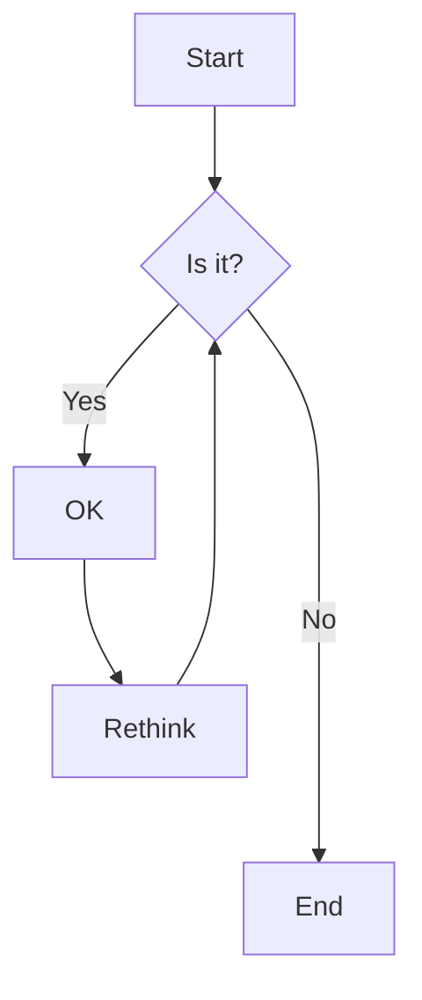
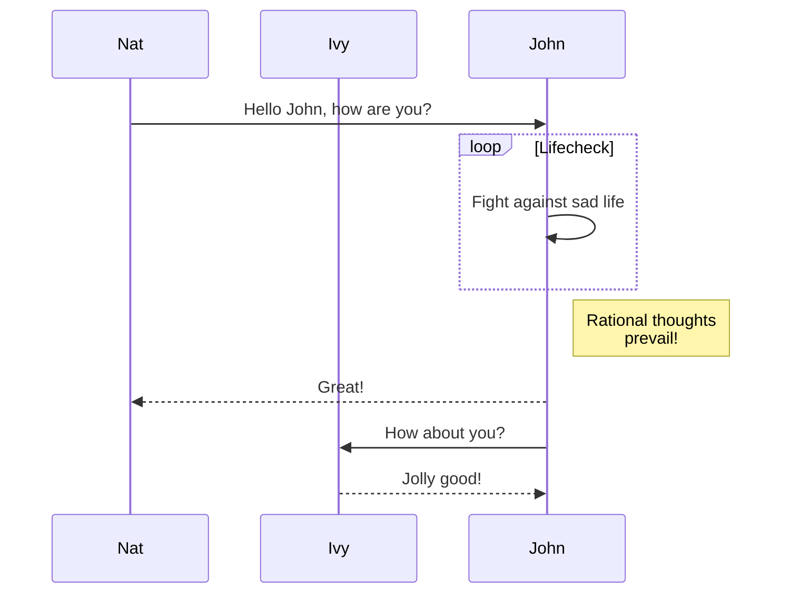
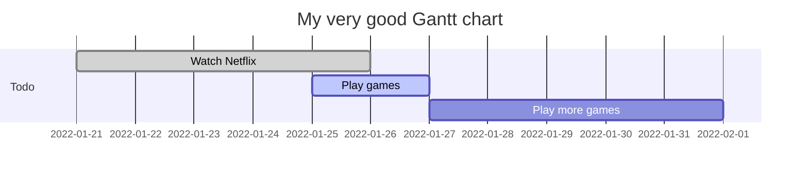
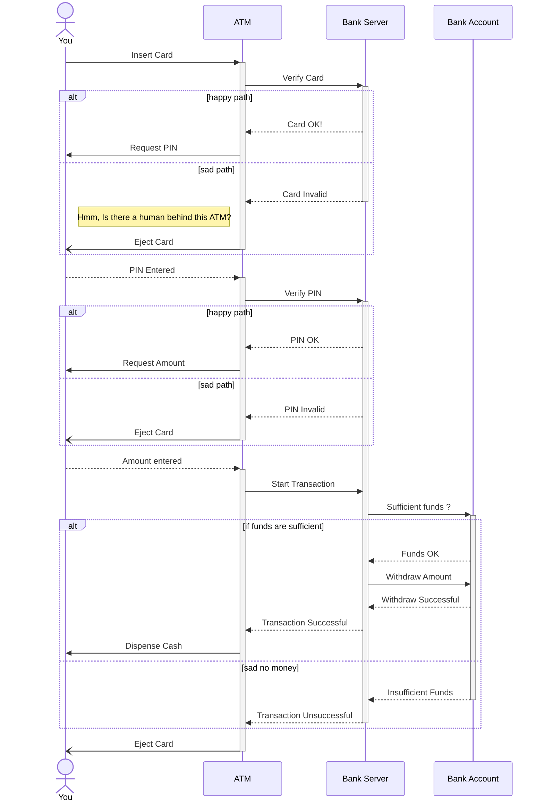

# example mermaid

This is just a demo web application using "Mermaid". It lets you create diagrams and visualizations using text and code.

See demo: https://lightzane.github.io/example-mermaid

### Graph

### Flowchart

`TD` = Top Down
`LR` = Left Right

### Sequence Diagram

### Gantt Chart

### Sequence Diagram (extended)

# Reference

-   https://mermaid-js.github.io/mermaid/#/
-   https://unpkg.com/mermaid@8.13.10/dist/mermaid.core.js
